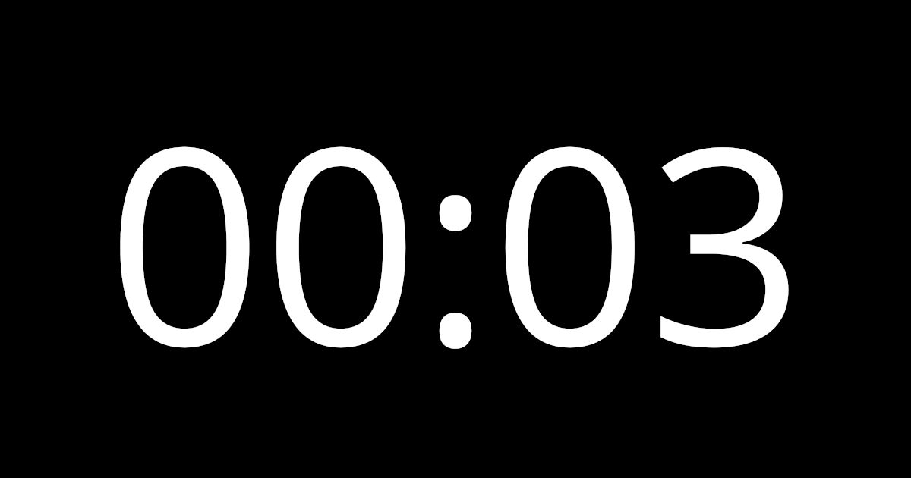

# Just Countdown

Countdown timer with remote control.

- Web: [just-countdown.eu](https://just-countdown.eu/)
- Google Play Store: [Just Countdown](https://play.google.com/store/apps/details?id=eu.just_countdown.twa)
- Microsoft Store: [Just Countdown](https://apps.microsoft.com/store/detail/just-countdown/9P65S6HKWB6P)



[demo](https://user-images.githubusercontent.com/1045362/165823939-cb697d8d-8de0-4861-b781-af73e5551996.mp4)

## API (work in progress)

```
GET https://just-countdown.eu/api/control?id=my-countdown
```

Replace `my-countdown` with your own countdown ID.

### Optional parameters

Add any of them to the URL above.

- `start` (start countdown)
- `pause` (pause countdown)
- `togglePaused` (toggle paused state)
- `showHours` (show hours)
- `hideHours` (hide hours)
- `toggleHours` (toggle hours visibility)
- `set=60` (set countdown to 60 seconds)
- `adjust=10` (add 10 more seconds to countdown)

#### Example

1.  ```
    GET https://just-countdown.eu/api/control?id=my-countdown&set=300&hideHours&start
    ```

    Sets countdown to 5 minutes, hides hours and starts countdown.

1.  ```
    GET https://just-countdown.eu/api/control?id=my-countdown&adjust=-30
    ```

    Subtracts 30 seconds from countdown.

#### Note

- Server may be off by few seconds.

## Development

```bash
npm ci
npm run dev
```
